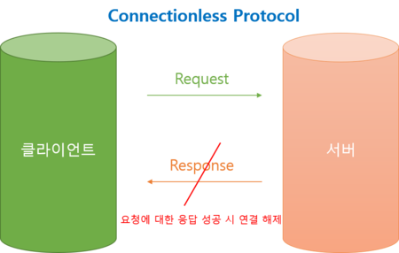
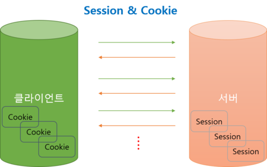

## HTTP 프로토콜의 Connectionless Protocol

서버와 클라이언트의 관계를 유지하는 웹서비스의 HTTP 프로토콜에서는 **Connectionless Protocol** 이라는 규칙이 있다.<br>
한 번의 요청에 대해서 응답한 후 바로 연결을 해제하는 것이 Connectionless Protocol 인데, 실제 요청이 몇 천, 몇 만개되는 웹 서비스에서는 요청을 그때그때 해제하지 않고 유지하게 되면 서버에 과부하가 걸리게 되기 때문이다.<br>



## 세션과 쿠키

Connectionless Protocol로 인해 서버의 과부하를 막을 수는 있지만, 로그인, 상품의 주문 요청 등 정보가 유지되어야 하는 기능의 구현이 어려워진다.<br>
그러한 기능을 구현하기 위해, Connectionless Protocol을 지키고 자원의 효율적 관리와 정보 유지를 위해 세션과 쿠키를 사용한다.<br>

**세션 : 서버에서 연결 정보를 관리 (보안에 더 강하고 많이 쓰임)**

**쿠키 : 클라이언트에서 연결 정보를 관리 (세션보다 비교적 간단하고, 서버의 부화를 줄이기 위해 사용)**



## 스프링에서의 세션 사용

### 1. HttpServletRequest를 이용해서 세션을 받음

컨트롤러에서 HttpServletRequest request를 파라미터로 받은 뒤,

```java
HttpServletRequest session = request.getSession();
// 세션에 속성을 추가
session.setAttribute("SessionName", SessionValue); // 속성 이름, 속성 값
// 세션에 속성 이름과 속성 값을 넣음
```

### 2. HttpSession -> 파라미터로 HttpSession을 바로 받아서 세션을 사용함

컨트롤러의 파라미터에 HttpSession로 바로 세션을 받아오면, request.getSession() 없이<br> 바로 session.setAttribute("SessionValueName", SessionValue); 을 사용할 수 있다.

### 3. 세션 삭제(로그아웃, 회원 탈퇴 등...)

```java
session.invalidate(); // 세션의 속성을 삭제한다.
```

### 반복

서버로 request -> setAttribute -> 세션 속성 저장 -> response -> 다시 request(재요청) -> getAttribute -> 세션 속성 반환 -> response <br>
반복

## 스프링에서의 Cookie 사용

### httpServletResponse에 쿠키를 담는다.

```java
Cookie ExampleCookie = new Cookie("CookieName",CookieValue); // 쿠키 이름, 쿠키 값
ExampleCookie.setMaxAge(60*60*24*30);
// 쿠키의 유효 시간 설정 -> 여기선 60*60*24*30초 임으로 한 달이다.
response.addCookie(ExampleCookie);
// response에 쿠키를 담는다.
```

### @CookieValue 어노테이션

스프링에서는 @CookieValue이라는 어노테이션으로 생성된 쿠키를 사용한다.<br>

```java
@CookieValue(value="찾는 쿠키 이름", require=false) Cookie cookieName;
// require -> true일 시, value에 해당하는 값이 없으면 익셉션 발생
```
